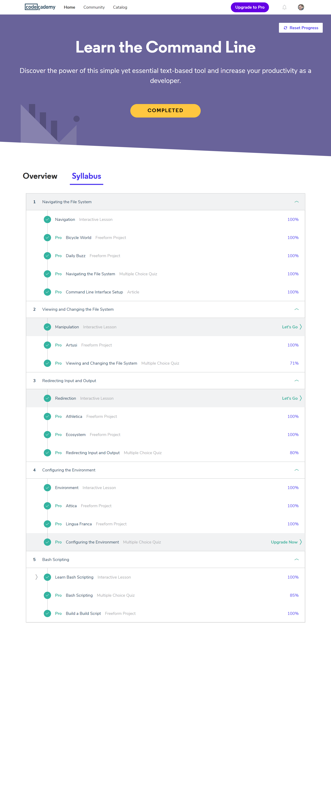

# kottans-frontend
Depository for materials on Kottans-Frontend course 

## Reflections on learning Git-Hub.

I've been aquinted with GitHub some time before I'd started kottans-frontend. I understood the main purpose of version control systems. But in the process of learning GitHub on Udacity I've got so many new precious information on working with git and GitHub. It really helped me understand all the hidden features of git and they could help me in my projects.

## Linux CLI, and HTTP

It was usefull to me to learn about such a usefull tool in CLI as grep. 
I was surprised with the fact that it had become more comfortable to use command line for file locating than Windows Explorer).
I think in the future I will use most of command line features I've learnt about recently.